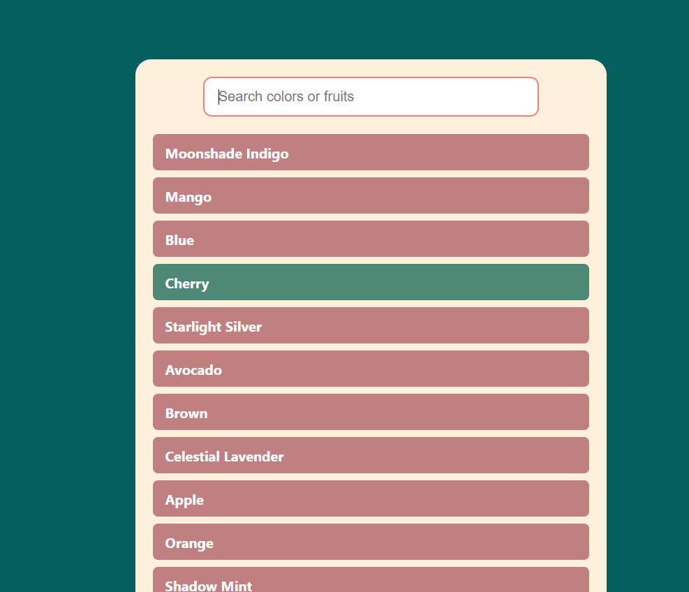

# 🔎 Search Bar Filter (React)

A sleek and responsive **React** search bar component that filters a dynamic list of items as you type — real-time, smooth, and beginner-friendly.

---

## 📌 Features
- ✅ **Real-time Filtering**: Instantly filter through color or fruit names.
- ✅ **Responsive Design**: Clean, centered UI layout.
- ✅ **Aesthetic UI**: Styled with a separate CSS file.
- ✅ **Beginner Friendly**: Simple use of `useState` and array filtering.

---

## 🛠️ Technologies Used
- ⚛️ **React** (`useState`)
- 🎨 **CSS** (`Search.css` for styling)
- 📄 **HTML / JSX** (structured inside `Search.js`)

---

## 🚀 Live Demo
To see it in action, clone the repository and follow the setup instructions below.

1. **Clone the repository:**

   ```bash
   git clone  https://github.com/Eshhaa11/search-bar-with-filtering
   
   
2. **Navigate to the project directory:**

   cd  search-bar-with-filtering

3. **Install dependencies:**

   npm install

4. **Start the development server:**

   npm start

5. **Open your browser and visit:**

   http://localhost:3000

---

 ## 🎨 Screenshots:
 

 ---

 ## 🤝 Contributing:
 Want to improve this project? Fork the repository, create a feature branch, and open a pull request. All contributions are welcome! 🚀✨
 
 ---

 🎉 Happy Coding!